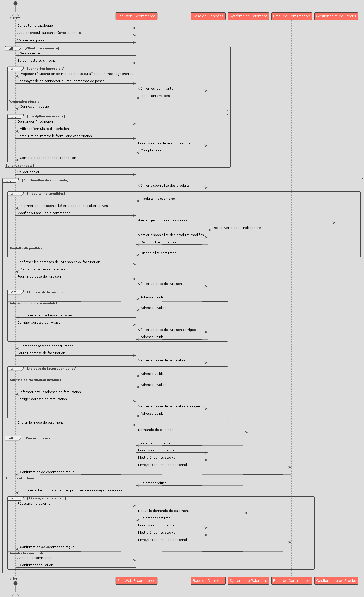
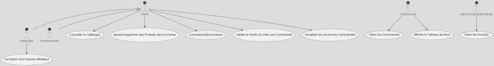

# Cahier des Charges - VillageGreen
# Identification des Acteurs

Pour le système VillageGreen, les acteurs principaux sont :

1. **Client**
   - Particulier
   - Professionnel
2. **Commercial**
3. **Gestionnaire de Produits**

# Identification des Cas d'Usage

Voici les principaux cas d'usage pour le système VillageGreen :

1. **Consultation du Catalogue**
   - Acteur principal : Client
2. **Ajout de Produit au Panier**
   - Acteur principal : Client
3. **Validation du Panier et Passage de Commande**
   - Acteur principal : Client
4. **Connexion/Déconnexion d'un Utilisateur**
   - Acteur principal : Client
5. **Inscription d'un Nouvel Utilisateur**
   - Acteur principal : Particulier
6. **Visualisation des Anciennes Commandes**
   - Acteur principal : Client
7. **Gestion des Produits**
   - Acteur principal : Gestionnaire de Produits
8. **Gestion des Commandes**
   - Acteur principal : Commercial

# Scénario Détaillé - Création d'une Commande

## Flux Principal

1. Le client consulte le catalogue.
2. Le client ajoute des produits au panier en saisissant les quantités désirées.
3. Le client se connecte (si pas encore connecté).
4. Le client valide le panier.
5. Le client vérifie et confirme les adresses de livraison et de facturation.
6. Le client choisit le mode de paiement et procède au paiement.
7. Le système de paiement confirme la transaction.
8. Le système enregistre la commande dans la base de données.
9. Le système met à jour les stocks.
10. Le système envoie une confirmation de commande par email au client.
11. **Postcondition :** La commande est enregistrée et confirmée, les stocks sont mis à jour.

## Flux Alternatifs

### 1. Produit Indisponible au Moment de la Validation du Panier

- Si un produit devient indisponible lors de la validation, le système informe le client et propose des alternatives ou la suppression du produit indisponible.
- Le client peut choisir de modifier la commande ou de l'annuler.
- Le flux principal reprend après la modification de la commande.

### 2. Connexion Impossible

- Si le client rencontre des problèmes de connexion, le système propose des options de récupération de mot de passe ou affiche un message d'erreur avec des instructions pour résoudre le problème.
- Le client peut essayer de se reconnecter ou récupérer son mot de passe.
- Le flux principal reprend après une connexion réussie.

### 3. Problème lors de la Création du Compte

- Si le client rencontre un problème technique ou un conflit avec un compte existant lors de la création du compte, le système affiche un message d'erreur explicatif et propose des solutions pour résoudre le problème, comme contacter le support technique.

### 4. Paiement Échoué

- Si le paiement échoue, le système informe le client et propose de réessayer ou d'annuler la commande.
- Le client peut choisir de réessayer le paiement ou d'annuler la commande.
- Le flux principal reprend après la confirmation du paiement.

### 5. Adresse de Livraison Non Valide

- Si l'adresse de livraison est non valide, le système informe le client et demande de corriger l'adresse.
- Le client corrige l'adresse et le flux principal reprend.


### Diagramme Séquence



### Diagramme Utilisation



```plantuml 
@startuml
!theme toy
actor Client
participant "Site Web E-commerce" as SW
participant "Base de Données" as BD
participant "Système de Paiement" as SP
participant "Email de Confirmation" as EC

Client -> SW: Consulter le catalogue
Client -> SW: Ajouter produit au panier (avec quantités)
Client -> SW: Valider son panier

alt Client non connecté
    Client -> SW: Se connecter
    alt Connexion impossible
        SW -> Client: Proposer récupération de mot de passe ou afficher un message d'erreur
        Client -> SW: Réessayer de se connecter ou récupérer mot de passe
        SW -> BD: Vérifier les identifiants
        BD --> SW: Identifiants valides
    else Inscription nécessaire
        Client -> SW: Demander l'inscription
        SW -> Client: Afficher formulaire d'inscription
        Client -> SW: Remplir et soumettre le formulaire d'inscription
        SW -> BD: Enregistrer les détails du compte
        BD --> SW: Compte créé
        SW -> Client: Compte créé, demander connexion
    end
end

Client -> SW: Valider panier
SW -> BD: Vérifier disponibilité des produits
alt Produits indisponibles
    BD --> SW: Produits indisponibles
    SW -> Client: Informer de l'indisponibilité et proposer des alternatives
    Client -> SW: Modifier ou annuler la commande
    SW -> BD: Vérifier disponibilité des produits modifiés
    BD --> SW: Disponibilité confirmée
end

Client -> SW: Confirmer les adresses de livraison et de facturation
SW -> Client: Adresses confirmées
alt Adresse de livraison non valide
    SW -> Client: Informer erreur adresse
    Client -> SW: Corriger l'adresse
end

Client -> SW: Choisir le mode de paiement
SW -> SP: Demande de paiement
alt Paiement réussi
    SP --> SW: Paiement confirmé
    SW -> BD: Enregistrer commande
    SW -> BD: Mettre à jour les stocks
    SW -> EC: Envoyer confirmation par email
    EC --> Client: Confirmation de commande reçue
else Paiement échoué
    SP --> SW: Paiement refusé
    SW -> Client: Informer échec du paiement et proposer de réessayer ou annuler
    alt Réessayer le paiement
        Client -> SW: Réessayer le paiement
        SW -> SP: Nouvelle demande de paiement
        SP --> SW: Paiement confirmé
        SW -> BD: Enregistrer commande
        SW -> BD: Mettre à jour les stocks
        SW -> EC: Envoyer confirmation par email
        EC --> Client: Confirmation de commande reçue
    else Annuler la commande
        Client -> SW: Annuler la commande
        SW -> Client: Confirmer annulation
    end
end

@enduml

@startuml
actor Client
actor Particulier as P
actor Professionnel as Pro
actor Commercial
actor GestionnaireDeProduits as GDP

Client <|-- P
Client <|-- Pro

usecase "Consulter le Catalogue" as UC1
usecase "Ajouter/Supprimer des Produits dans le Panier" as UC2
usecase "Inscription d'un Nouvel Utilisateur" as UC3
usecase "Connexion/Déconnexion" as UC4
usecase "Valider le Panier et Créer une Commande" as UC5
usecase "Visualiser les Anciennes Commandes" as UC6
usecase "Gérer les Produits" as UC7
usecase "Gérer les Commandes" as UC8
usecase "Afficher le Tableau de Bord" as UC9

Client --> UC1
Client --> UC2
P --> UC3
Client --> UC4
Client --> UC5
Client --> UC6
GDP --> UC7
Commercial --> UC8
Commercial --> UC9
@enduml

